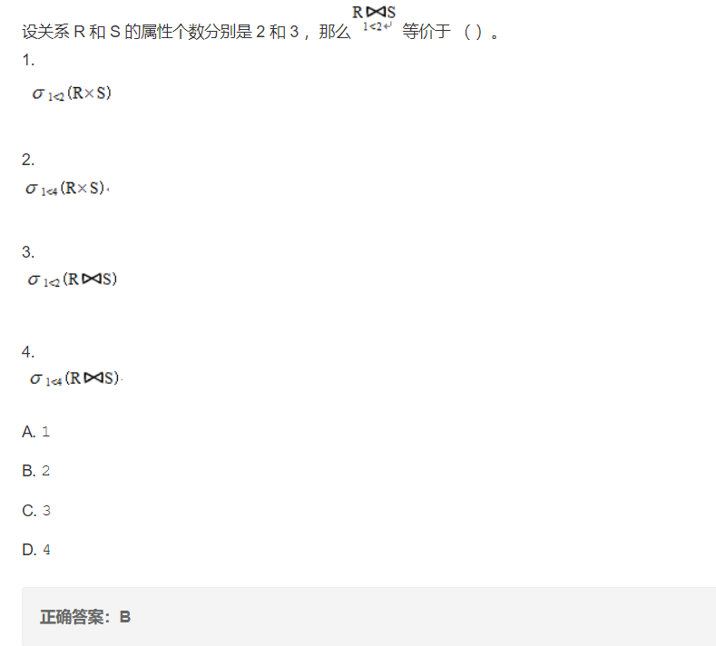

# 第一章

1. 数据库中，数据的物理独立性是指？（ C ）

A.     数据库与数据库管理系统的相互独立

B.      用户程序与DBMS的相互独立

**C.      用户的应用程序与存储在磁盘上数据库中的数据是相互独立的**

D.     应用程序与数据库中数据的逻辑结构相互独立

> 物理独立性：用户的应用程序与存储在磁盘上数据库中的数据是相互独立的
>
> 逻辑独立性：应用程序与数据库中数据的逻辑结构相互独立

2. 数据库管理系统的工作不包括？（C）

A.     定义数据库

B.      对已定义的数据库进行管理

**C.      为定义的数据库提供操作系统**

D.     数据通信

> D选项：比如说主外键等

3. 产生数据不一致现象的根本原因是：数据冗余

4. 在数据库中存储的是？   D

   A.     信息

   B.      数据

   C.      数据模型

   **D.     数据以及数据之间的联系**

# 第二章

1、

> 题解：将两个表做笛卡尔积（不是连接，连接可能会丢失属性组）之后会产生5个属性，第一个表的第一个属性还是新表的第一个属性，第二个表的第二个属性变成了新表的第四个属性。

2、对于关系模型叙述错误的是    D    。

A．建立在严格的数学理论、集合论和谓词演算公式基础之一

B．微机DBMS绝大部分采取关系数据模型

C．用二维表表示关系模型是其一大特点

**D．不具有连接操作的DBMS也可以是关系数据库管理系统**

3、有两个关系R和S，分别包含15个和10个元组，则在R，R-S，R S中不可能出现的元组数目情况是   B     。

A．15，5，10                             **B．18，7，7**

C．21，11，4                             D．25，15，0

4、当两个关系没有公共属性时，其自然链接操作表现为笛卡尔积。

> 自然连接：要求做连接的两个关系进行比较的属性组具有相同的属性名，但是如果没有相同名字的属性组则退化为笛卡尔积 

5、关系运算中和花费时间最长的可能是**笛卡尔积**

# 第3、4、5章

7、如果数据库应用系统的用户表中存有用户登录口令，则应该（A）

**A. 对用户登录口令进行加密存储**   

B. 撤销任何用户对用户表的访问权限，限止登录口令泄漏

C. 将用户记录的操作权限仅赋予该用户本人    

D.只允许 DBA 直接查看登录口令

19、下列聚合函数中不忽略空值(null)的是（　C　　）。

A. SUM (列名) 

B. MAX (列名)   

**C. COUNT ( \* )**     

D. AVG (列名)

# 第六章

1、关于E-R 图合并，下列说法不正确的是  ( D )。

A. E-R 图合并可以解决信息冗余

B. E-R图合并可以解决各分E-R 图之间存在的冲突

C. E-R图合并可以从总体上认识企业信息      

**D. E-R 图合并可以发现设计是否满足信息需求**

2、在需求分析阶段，需求调查的内容是 (   C     )。

A. 信息要求、安全性要求

B. 安全性、完整性要求、数据字典

**C. 信息要求、处理要求、安全性与完整性要求**      

D. 信息要求、安全性要、E-R图

# 第八章

1、下面选项中不属于存储过程的优点的是（  D  ）。

A. 可以使运行加快速度，减少网络流量           

B. 方便实施企业规则  

 C. 增强代码的重用性和共享性                 

**D. 编辑简单**

# 第十、十一章

1、使某个事务永远处于等待状态，而得不到执行的现象称为(   B   )。

A.死锁                           

**B.活锁**

C.串行调度                       

D.不可串行调度

2、关于SQL SERVER的几种备份类型，下列说法中错误的一项是（    C   ）。
A．利用事务日志进行恢复时，不可以指定恢复到某一个事务
B. 差异备份是指将从最近一次完整数据库备份以后发生改变的数据备份
**C. 即使没有完整备份，也可以执行差异备份和事务日志备份**
D. 当一个数据库很大时，对整个数据库进行备份可能会花很多的时间，这时可以采用
文件和文件组备份

3、对事务回滚的正确描述是 (    B    )。
A. 将事务中修改的变量值恢复到事务开始时的初值
**B. 将该事务对数据库的修改进行恢复**
C. 跳转到事务程序的开头重新执行     
D. 将事务对数据库的更新写入硬盘

4、关于备份策略的描述，正确的是 (   C     )。
A. 动态备份适合在事务请求频繁时进行    
B. 静态备份应经常进行
**C. 数据更新量小时适合做动态备份**        
D. 海量备份适合在事务请求频繁时进行

5、在数据库的安全性控制中，授权的数据对象的(   A     )，授权子系统就越灵活 。 
**A. 范围越小**              
B. 范围越大
C. 约束范围大            
D. 约束越明显

6、事务故障恢复的描述，正确的是 (   B     )。
A. 事务故障的恢复需要日志和数据库复本
**B. 事务故障的恢复只需要日志，不需DBA参与**
C. 事务故障的恢复需要数据库复本      
D. 事务故障的恢复必须DBA参与

> 事务故障的恢复，系统悄悄的进行

