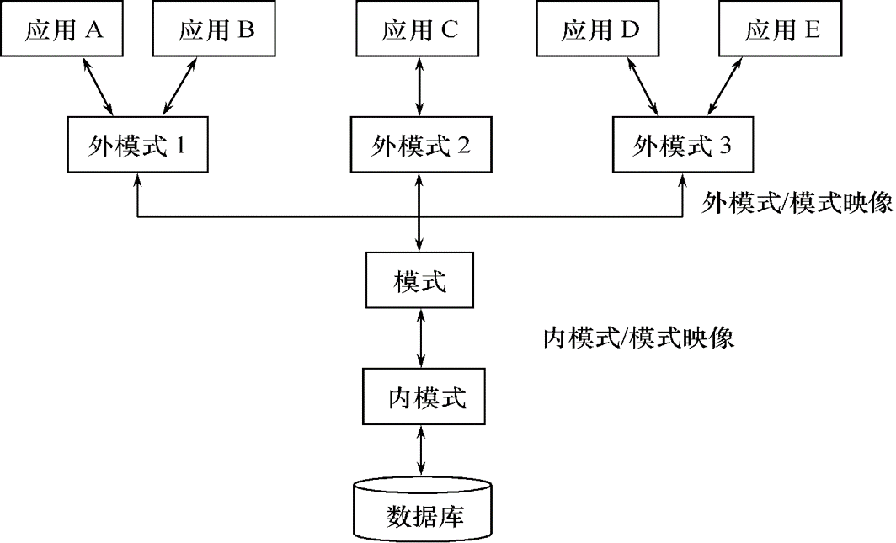

# 1.绪论

## 1.1数据库系统概论

### 1.1.1四个基本概念

1. **数据**：数据库中存储的基本对象，描述一个事物的符号记录，数据和其语义不可分开说

2. **数据库**（DB）：是长期储存在计算机内、有组织的、可共享的大量**数据的集合。**

   基本特征：

   1）数据按一定的数据模型组织、描述和储存

   2）可为各种用户共享

   3）冗余度较小

   4）数据独立性较高

   5）易扩展

3. **数据库管理系统**：一个管理数据的软件

   主要功能：

   1）数据定义功能：（1）提供数据定义语言(DDL)，主要包括三种操作：创建表（CREATE），修改表（ALTER），删除表（DROP）；（2）定义数据库中的数据对象

   2）数据组织，存储和管理：（1）分类组织、存储和管理各种数据；（2）确定组织数据的文件结构和存取方式；（3）实现数据之间的联系；（4）提供多种存取方法提高存取效率

   3）数据的操纵功能：（1）提供数据操纵语言(DML，即增删改查的操作)；（2）实现对数据库的基本操作  (

   查询、插入、删除和修改)

   4）数据库的事务管理和运行管理：数据库在建立、运行和维护时由DBMS统一管理和控制保证数据的安全，完整性、多用户对数据的并发使用发生故障后的系统恢复

   5）数据库的建立和维护功能：（1）数据库初始数据装载转换；（2）数据库转储；（3）介质故障恢复；（4）数据库的重组织；（5）性能监视分析等

   6）其他功能：（1）DBMS与网络中其它软件系统的通信；（2）两个DBMS系统的数据转换；（3）异构数据库之间的互访和互操作

4. **数据库系统**：是由**数据库、数据库管理系统应用程序和数据库管理员（DBA）**等组成的存储、管理、处理和维护数据的系统。

5. **信息系统的概念**：数据库技术是**信息系统**的核心和基础，管理信息系统（ManagementInformation System，简称MIS）是一个以人为主导，利用计算机硬件、软件、网络通信设备以及其他办公设备，进行信息的收集、传输、加工、储存、更新、拓展和维护的系统

### 1.1.2产生和发展

1. 数据管理：对数据进行分类、组织、编码、存储、检索和维护。

2. 数据处理：对数据进行收集、存储、加工和传播。其目的有二，一、从大量原始数据中推导出有价值的信息，二、利用计算机科学地管理这些数据

3. 发展的过程：

   1）三个管理阶段的比较

   |                | 人工管理阶段           | 文件系统阶段                 | 数据库系统阶段                                             |
   | -------------- | ---------------------- | ---------------------------- | ---------------------------------------------------------- |
   | 时间           | 20世纪50年代中期以前   | 20世纪50年代后期到60年代中期 | 20世纪60年代后期以来                                       |
   | 应用背景       | 科学计算               | 科学计算、数据管理           | 大规模数据管理                                             |
   | 硬件背景       | 无直接存取存储设备     | 磁盘、磁鼓                   | 大容量磁盘、磁盘阵列                                       |
   | 软件背景       | 没有操作系统           | 有文件系统                   | 有数据库管理系统                                           |
   | 处理方式       | 批处理                 | 联机实时处理、批处理         | 联机实时处理、分布处理、批处理                             |
   | 数据的管理者   | 用户（程序员）         | 文件系统                     | 数据库管理系统                                             |
   | 数据面向的对象 | 某一应用程序           | 某一应用                     | 现实世界（一个部门、企业、跨国组织等）                     |
   | 数据的共享程度 | 无共享，冗余度极大     | 共享性差，冗余度大           | 共享性高，冗余度小                                         |
   | 数据的独立性   | 不独立、完全依赖于程序 | 独立性差                     | 具有高度的物理独立性和一定的逻辑独立性                     |
   | 数据的结构化   | 无结构                 | 记录内有结构、整体无结构     | 整体结构化，用数据模型描述                                 |
   | 数据控制能力   | 应用程序自己控制       | 应用程序自己控制             | 由数据库管理系统提供数据安全性、完整性、并发控制和恢复能力 |
   | 数据的保存     | 不保存                 | 长期保存                     | 长期保存                                                   |

### 1.1.3数据库管理系统的特点

1. 数据库系统的特点：

   1）**数据结构化**：

   （1）这里的结构化指的是**整体数据的结构化**，整体数据的结构化是数据库的主要特征之一 ；

   （2）不再仅仅针对某一个应用，而是面向全组织（即全部的应用，而不是具体的某一个应用），不仅数据内部结构化，整体是结构化的，**数据之间具有联系**

   （3）数据的结构用**数据模型**描述，无需程序定义和解释；数据可以变长（真的只是长度可变）；数据的最小存取单位是**数据项**，而在文件系统中数据的存取单位是记录。

   2）**数据的共享性高，冗余度低，易扩充**

   （1）数据库系统从整体角度看待和描述数据，数据面向整个系统，可以被多个用户、多个应用共享使用

   （2）数据的共享：减少数据冗余，节约存储空间；避免数据之间的不相容性与不一致性 ；使系统易于扩充

   3）**数据独立性高：**由数据库管理系统的二级映像保证

   （1）物理独立性：指用户的应用程序与存储在磁盘上的数据库中数据是相互独立的。当数据的物理存储改变了，应用程序不用改变。

   （2）逻辑独立性：指用户的应用程序与数据库的逻辑结构是相互独立的。数据的逻辑结构改变了，用户程序也可以不变。

   4）数据由DBMS统一**管理和控制**

   （1）数据的安全性保护：保护数据，以**防止**不合法的使用造成的**数据的泄密和破坏**

   （2）数据的完整性检查：将数据**控制在有效的范围内**，或保证数据之间满足一定的关系

   （3）并发控制：对多用户的并发操作加以控制和协调，**防止相互干扰**而得到错误的结果

   （4）数据库恢复：将数据库从错误状态恢复到某一已知的正确状态

## 1.2数据模型

#### 1.2.1基本概念

1. 模型：对现实世界的模拟
2. 满足的条件：1）比较真实；2）便于理解；3）便于实现

#### 1.2.2两类数据模型

1. 概念模型：第一次抽象，用于数据库设计

2. 逻辑模型和物理模型：第二次抽象

   1）**逻辑模型**主要包括**网状模型、层次模型、关系模型、面向对象模型**等，按计算机系统的观点对数据建模，用于DBMS实现 

   2）**物理模型**是对数据最底层的抽象，描述**数据在系统内部的表示方式和存取方法**，在磁盘或磁带上的存储方式和存取方法

#### 1.2.3数据模型的组成要素

1. 数据结构

   1）描述数据库的组成对象，以及对象之间的联系

   2）描述与数据之间联系有关的对象

   3）**是对系统静态特性的描述**

   4）分类：（1）非关系型：网状，层次；（2）关系型；（3）面向对象型

2. 数据操作

   1）对数据库中各种对象(型)的实例(值)允许**执行的操作及有关的操作规则**

   2）增删改查

   3）是对系统动态特性的描述

3. 数据的完整性约束条件

   1）一组完整性规则的集合

   2）完整性规则：给定的数据模型中数据及其联系所具有的**制约和储存规则** 

   3）用以限定符合数据模型的数据库状态以及状态的变化，以保证数据的正确、有效、相容

   4）定义：

   （1）反映和规定本数据模型必须遵守的**基本的通用的**完整性约束条件。例如在关系模型中，任何关系必须满足**实体完整性**和**参照完整性**两个条件 

   （2）提供定义完整性约束条件的机制，以反映具体应用所涉及的数据必须遵守的特定的语义约束条件（**用户定义完整性**）

4. 实体完整性：具体的数据的属性信息是否完整

   参照完整性：该属性对应的值存在

   用户定义完整性：看心情

#### 1.2.4关系模型

1. 基本概念：

   1）关系（Relation）：一个关系对应通常说的一张表

   2）元组（Tuple）：表中的一行即为一个元组

   3）属性（Attribute）：表中的一列即为一个属性，给每一个属性起一个名称即属性名

   4）码（Key） ：唯一确定一个元组的属性或属性组 

   5）域（Domain） ：是一组具有相同数据类型的值的集合

   6）分量：元组中的一个属性值

   7）关系模式：对关系的描述，一般表示为

   ​    关系名（属性1，属性2，……，属性n）

      学生（学号，姓名，年龄，性别，系，年级）

   8）注意规范：不能出现大表套小表。

2. 数据操作：增删改查，对若干元组操作的集合

3. 数据的完整性约束条件：

   1）实体完整性

   2）参照完整性

   3）用户定义完整性

## 1.3数据库系统结构

### 1.3.1数据库系统模式的概念

1. 型：对某一类数据的结构和属性的说明，（学号，姓名，性别，系别，年龄，籍贯）
2. 值：是型的一个具体赋值，（201315130，李明，男，计算机，19，江苏）
3. 模式：数据库逻辑结构和特征的描述，是型的描述，反映的是数据的结构及其联系，**模式是相对稳定的**，即属性名的集合
4. 实例：模式的一个**具体值**，反映数据库**某一时刻的状态**，同一个模式可以有很多实例，实例随数据库中的**数据的更新而变动**
5. 如果是一个成绩单：那么科目那一行表示的是模式（不仅仅只是这些，还包括其他的信息），每一个人的成绩一行表示的是一个实例

### 1.3.2数据库系统的三级模式结构

1. 模式：数据库中全体数据的逻辑结构和特征的描述，所有用户的公共数据视图，综合了所有用户的需求，**一个数据库只有一个模式**，模式是相对稳定的，但是实体是相对变动的

   **地位**：1）是数据库系统模式结构的中间层；2）与数据的物理存储细节和硬件环境无关；3）与具体的应用程序、开发工具及高级程序设计语言无关

   **定义**：1）数据的逻辑结构（数据项的名字、类型、取值范围等）；2）数据之间的联系；3）数据有关的安全性、完整性要求

2. 外模式：模式的**子集**，一个数据库可以有多个，是数据库中局部数据的逻辑结构和特征的描述

3. 内模式：1）是**数据物理结构和存储方式的描述**；2）是数据在**数据库内部的表示方式**

   一个数据库只有一个内模式。

### 1.3.3数据库的二级映像功能与数据的独立性

1. 外模式/模式映像：保证了数据的逻辑独立性。不唯一

   1）当模式改变时，数据库管理员修改有关的外模式／模式映象，使外模式保持不变

   2）应用程序是依据数据的外模式编写的，从而应用程序不必修改，保证了数据与程序的逻辑独立性，简称数据的逻辑独立性。

2. 模式/内模式映像：保证了数据的物理独立性。唯一

   1）当数据库的存储结构改变了（例如选用了另一种存储结构），数据库管理员修改模式／内模式映象，使模式保持不变，进而外模式也不发生改变

   2）应用程序不受影响。保证了数据与程序的物理独立性，简称数据的物理独立性

3. 数据的存取由DBMS管理的好处：

   1）用户不必考虑存取路径等细节

   2）简化了应用程序的编制

   3）大大减少了应用程序的维护和修改

## 1.4数据库系统的组成

硬件，操作系统，数据库设计人员，数据库管理人员，数据库管理系统，用户等等。

