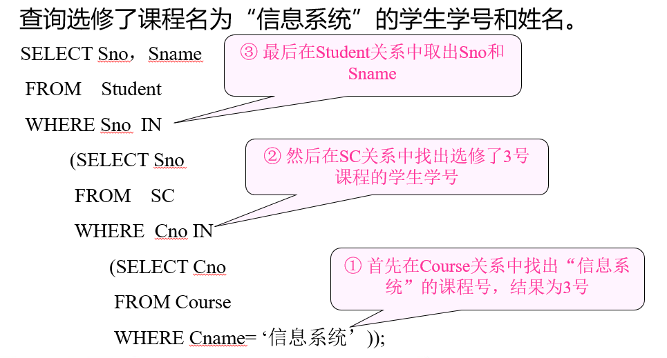
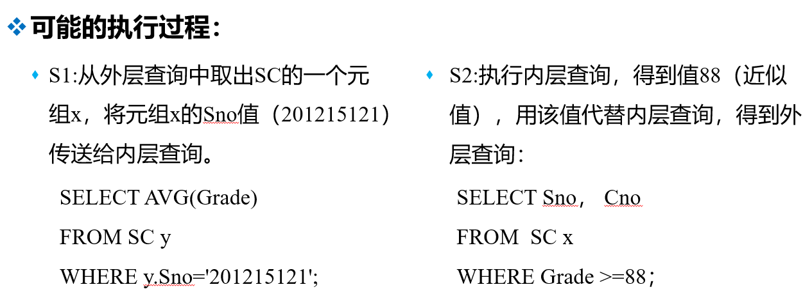
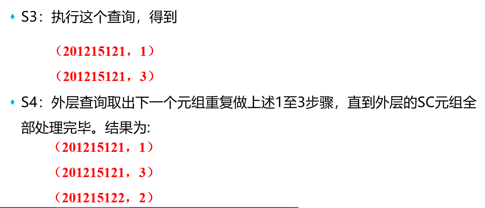
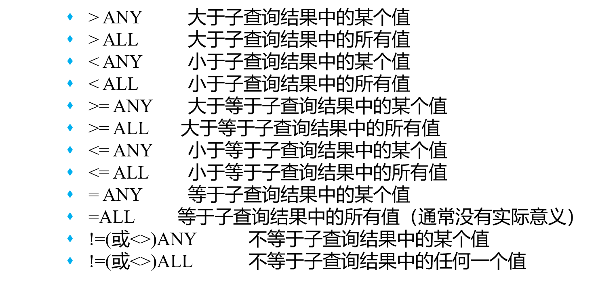
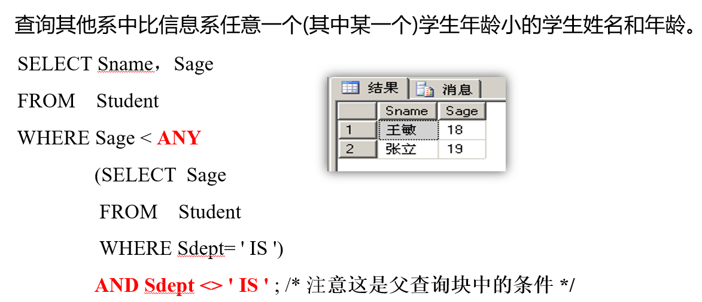
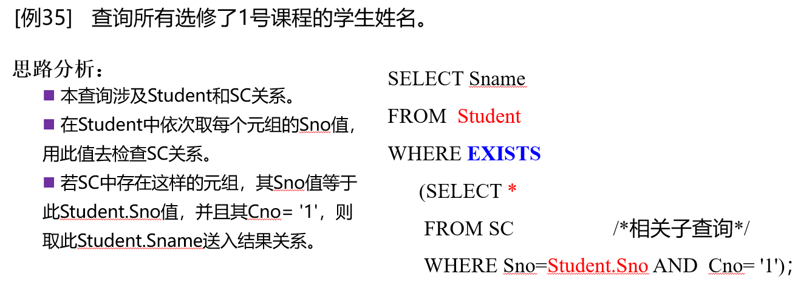
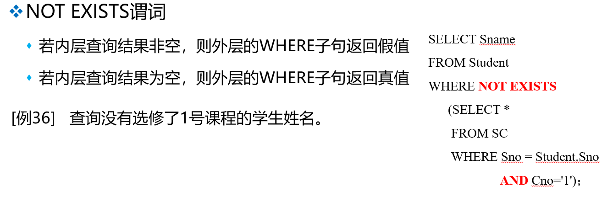

# 3.关系数据库标准语言SQL

## 3.1 SQL概述

### 3.1.1基本概念

1. SQL语言是一个功能极强的关系数据库语言。同时也是一种介于关系代数与关系演算之间的结构化查询语言（Structured Query Language），其功能包括**数据定义、数据查询、数据操纵和数据控制**。

2. SQL的特点：

   1）综合统一：集数据定义、数据查询、数据操纵和数据控制等多种功能于一体。

   2）高度非过程化 ：面对象的设计

   3）面向集合的操作方式 ：操作对象是集合，并且操作结果也是集合

   4）两种使用方式，统一的语法结构 ：既是一种独立的语言，又是一种嵌入式的语言，（嵌入式是指嵌入别的高级语言）。

   5）简洁易学

## 3.2 学生-课程数据库

## 3.3 数据定义

### 3.3.1 数据库的创建与基本概念

**一、创建数据库：**

代码：

~~~sql
create database Student;        --创建数据库
use Student;                    --使用数据库
drop database Student;          --删除数据库
~~~

注意：

1）两种注释方式：（1）两个减号--，注释单行 （2）/* */注释多行

2）不能再当前数据库删除当前数据库

**二、数据类型：**

注意：

1）一个属性采用何种数据类型由两部分决定：（1）该属性的取值范围；（2）该属性做何种运算。

### 3.3.2模式的创建与删除

**一、创建模式：**

模式，一个独立于数据库用户的**非重复命名空间**，在这个空间中可以**定义该模式包含的数据库对象**，例如基本表、视图、索引等。

代码：

~~~sql
/** 创建模式zhang，下键表student*/
create schema zhang
	create table student
	(
		Sno char(9) primary key,
		Sname varchar(20) unique,
		Ssex char(4) not  null,
		Sage smallint,
		Sdept varchar(5)		
	);

/** 删除模式中的表*/
drop table zhang.student;

/** 删除模式*/
drop schema zhang;    --注意前提该模式下无对象
~~~

**注意：**

1）删除模式的时候首先应当将模式下的所有对象删除，才能删除该模式

2）在删除某个非dbo模式下的表时，需要加模式名

3）该模式不是三级模式两级映像中的模式，而是相当于一个**命名空间**（主要可以解决重名的问题）

4）CASCADE(级联)：删除模式的同时把该模式中所有的数据库对象全部删除（SQL Server不支持）

5）RESTRICT(限制)：只有当该模式中没有任何下属的对象时才能执行

### 3.3.3表的定义、删除与修改

**一、创建表（三张）**：（1）学生表（Student）（2）课程表（Course）（3）学生课程表（SC）

1）学生表（Student）

代码：

~~~sql
/** 未添加数据*/
create table student
(
	Sno char(9) primary key,          --primary key   指示主码
	Sname varchar(20) unique,         --unique        指示值唯一，
	Ssex char(4) not  null,           --not null      该值非空
	Sage smallint,
	Sdept varchar(5)	
);
~~~

2）课程表（Course）

代码：

~~~sql
/** 创建课程表*/
create table Course
(
	Cno char(2) primary key,
	Cname varchar(10) unique,
	Cpno char(2),                --Cpno是外码，参照的是自身的Cno
	Ccredit smallint,
	foreign key (Cpno) references Course(Cno)     --外码
);
~~~

3）学生-课程表

代码：

~~~sql
/** 创建学生-课程表*/
create table SC
(
	Sno char(9),
	Cno char(2),
	Grade int,
	primary key(Sno, Cno),            --多个属性列构成主码，写在最后
	foreign key(Sno) references student(Sno),    --外码， 每个外码写一行
	foreign key(Cno) references Course(Cno)
);
~~~

**注意：**

1）创建表的时候需要考虑三个完整性约束条件：实体完整性，参照完整性，用户自定义完整性

2）两种完整性约束条件的定义方式：

* **列级完整性约束条件**：涉及相应属性列的完整性约束条件，在属性列的后边定义。

* **表级完整性约束条件**：涉及一个或多个属性列的完整性约束条件 ，在将属性列完之后定义。

3）外码要和所参照的主码类型相同。表级完整性约束的时候属性列需要加括号。

4）定义

**二、修改表**

**增加列**

~~~sql
alter table student add graduation date;
/*
1. 指定要修改的表
2. add关键字
3. 新增列的属性名
4. 新增列的数据类型
*/
~~~

**删除列**

~~~sql
alter table student drop column graduation;
~~~

**修改列的数据类型**

~~~sql
alter table student alter column graduation varchar(20); 
~~~

**增加约束**

~~~sql
/*这种增加约束的方法不容易从左边的框框（键）中看出来*/
alter table student add unique(graduation);

/*给增加的约束自定义了一个别名，容易区分*/
alter table student add constraint S_un unique(graduation);

/*注意*/
--1. 不可以使用增加not null约束，想要添加只可以在设计中将勾去掉
--虽然以下的方式看似添加了not null约束，但是不起任何作用
alter table student add constraint cc check(sname is not null);

--2. 给某一属性列添加主键，需要保证该属性列不允许为空，刚建的新表在未加约束的情况下，默认属性列允许为空值
alter  table  student  add primary key(sno,cno);

--3. 添加外键，需要保证外码和被参照表的主属性的数据类型保持一致
alter  table  student  add foreign key (sno) references student(sno);
~~~

**删除约束**

~~~sql
/*通过指定的约束名字删除指定的约束*/
alter table student drop constraint S_un;

/*在左边单机右键删除*/
~~~

**三、删除表**

~~~sql
/*删除表的时候必须先将参照表干掉，再删除被参照表*/
drop table student；
~~~

### 3.3.4索引的建立与删除

> 建立索引的目的是加快数据查询的速度。DBA或者表的属主可以根据需要建立表的索引；但是有些DBMS可以自动建立以下索引，1）PRIMARY  KEY索引（聚簇索引）2）UNIQUE索引（唯一性索引）

**一、创建索引**

~~~sql
/*创建唯一性索引*/
/*
 * stu为索引名字，创建索引必须要有一个索引名
 * 列名后面紧跟排序类型，ASC为升序，DESC为降序，默认为ASC，可以有多个列，用逗号隔开。
 * 对于已经包含重复值的属性列不可以增加唯一性索引
*/
create unique index S_nn on student(graduation asc);

/*创建聚簇索引（聚集）*/
Create  clustered index stu on student(sage desc);
/*
 * 聚簇索引的关键字为clustered,不是书上有误，而是sqlserver是这样
 * 同样，列名后面紧跟排序类型，可以有多个列，用逗号隔开。
 * 聚簇索引严格按照物理存储位置来排序。
 * 不可以在有主键的表中创建索引
 * 一个表只能创建一个聚簇索引
*/
~~~

**二、删除索引**

~~~sql
/*注意：删除索引必须为表名+索引名*/
drop  index  student.stu
~~~

## 3.4 数据查询

### 3.4.1单表查询

#### 简单的查询操作：

~~~sql
--投影，select后边指明所选的列，from指明所访问的表
select sno, sname, sdept
from student;

--选择指定的列，可以加算术表达式，并且为其添加新的属性名
select sno, 2019-sage as birthday
from student;

--投影后，修改属性名
select sno num, 2019-sage birthday
from student;

--*代表选中所有列
select *
from student;

--除了int，smallint，其余的数据类型需要单引号''
select sname,'2017' year
from student;

--字符串的拼接
--5)查询全体学生的姓名、联系电话，并在前面加上字符串‘联系方式’
select sname, '联系方式'+tel
from student;

--select后加函数
--count函数空值不计，重复值重复计
--当count函数作用在全部列上时以元组计数
select COUNT(sno)
from student;

--COUNT的含义是计数，*表示所有列，COUNT（*）表示元组数，某个或部分属性列为空值不影响count统计结果
select COUNT(*)		
from student;

--去重，distinct作用域是整个元组，是所有指定列组成的元组的去重
select distinct sno, cno
from sc;

--查询性别为女的学生的学号，姓名
select sno, sname
from student
where ssex = '女';

--查询学分为4学分的课程的名字
select cname
from course
where ccredit = 4;

--查询成绩在85分以上的学生的学号（学号不重）
select distinct sno
from sc
where grade > 85;

--查询年龄在20~23岁（包括20岁和23岁）之间的学生的姓名、系别和年龄。
SELECT Sname,Sdept,Sage	
FROM Student
WHERE Sage BETWEEN 20 AND 23;

--不能写成sdept='CS','IS','MA'
select sname,ssex
from student
where sdept='CS' or sdept='IS' or sdept = 'MA';

--IS NULL， IS NOT NULL空值：只能用“is”，不能用“=”
--WHERE NOT Sage >= 20；not必须在 sage前边，而不是>=前边

select sname,ssex
from student
where sdept in ('CS','IS','MA');

--模糊查询
--%任意长度，_单个字符，__表示两个或两个以内
--转义字符\，需要加escape '\'标注
select *
from student
where sname like '刘__';

select *	--如果字符中本身带有下划线，用任意字符当转义字符
from Course
where Cname like 'DB\_%i_ _' escape '\';
~~~

#### order by子句：

~~~sql
--order by子句
--选择sno列，从sc表中，cno为'3'，按成绩降序给出
--desc表示降序排列，asc表示升序排列，当缺省的时候表示asc
--在SqlServer中当排序的属性列中存在空值的时候，升序排列默认空值在元组最先显示，desc（降序）空值元组在最后显示
select sno
from sc
where cno = '3'
order by grade desc;

--多属性列排序，首先按ccredit进行升序排列，当ccredit相等的时候，按cpno进行降序排列
select *
from course
order by ccredit, cpno desc;
~~~

> 注意：
>
> * 首先将符合where子句的元组筛选出来，然后根据order by子句进行排序。

#### 聚集函数：

~~~sql
--count统计sc表中sno的数目，空值不计，重复值重复计
--distinct关键字，在计算式取消重复列中的重复值
select count (distinct sno)
from sc;

--统计元组的数目
select count(*)
from sc;

--求该列值的总和
select sum (grade)
from sc;

--求平均值，结果向下取整
select AVG (grade)
from sc;

--求最小
select min (grade)
from sc;

--求最大
select max (grade)
from sc;
~~~

**注意：**

1. 聚集函数全部都忽略空值
2. where子句中不能使用聚集函数作为条件表达式，聚集函数只能用在select子句或者group by中的having子句。
3. 聚集函数作用的元组是满足where子句中的条件的元组

#### group by子句：

~~~sql
--GROUP BY
--在有GROUP BY的语句中，select子句后边只可以出现分组属性列或者聚集函数，其他列名不可以，
--平均值计算略过空值
--首先按cno进行分组，分别统计每组中sno的数量和每组中的平均值，最后给每一新列起别名
select cno, count(sno) cnt,AVG (grade) av
from sc
group by cno;

--可以使用HAVING短语筛选最终输出结果,作用于组，从中选择满足条件的组
--同上首先通过cno分组，在通过having语句选出满足指定条件的组
select cno, count(sno) cnt, AVG (grade) av
from sc
group by cno
having COUNT(sno)>=2;

--查询选修了3门以上课程的学生学号
--首先使用group by进行分组，然后使用having选择满足条件的组
select sno,COUNT(cno)
from sc
group by sno
having COUNT(cno)>=3
~~~

注意：

1. where子句作用于基表或视图，从中选择满足条件的元组。
2. having短语作用于组，从中选择满足条件的元组
3. 使用group by子句后，select子句的列名列表中只能出现分组属性和聚集函数

### 3.4.2连接查询

#### 基本概念

1. 连接谓词中的列名称为连接字段

2. 连接条件中的各连接字段类型必须是可比的，但不必是相同的

3. SQL没有自动去掉重复列的功能

#### 基本操作

~~~sql
--from涉及两个表，不加连接条件，得到的是广义的笛卡尔积，select后跟的是最终显示的列
select student.*,sc.* 
from student,sc;

--加上连接条件，得到的是从广义笛卡尔积中选择满足指定条件的元组
--select后跟的是最终所显示的列，对于两个表公共的属性列需要使用表名进行区分，不属于公共列的不需要
--SqlServer没有自动去掉重复列的功能
select student.*,cno,grade  --去掉重复列
from student,sc
where student.sno=sc.sno;  --连接条件：不然是广义笛卡尔积

--或者--
select sc.sno,sname,sage,ssex,sdept,cno,grade   --去掉重复列
from student,sc
where student.sno=sc.sno;
~~~

> 一种可能的执行过程：
>
> 1）首先在表1中找到第一个元组，然后从头开始扫描表2，逐一查找满足连接条件的元组，找到后就将表1中的第一个元组与该元组拼接起来，形成结果表中一个元组 。
>
> 2）表2全部查找完后，再找表1中第二个元组，然后再从头开始扫描表2，逐一查找满足连接条件的元组，找到后就将表1中的第二个元组与该元组拼接起来，形成结果表中一个元组。
>
> 3）重复上述操作，直到表1中的全部元组都处理完毕。 

**自身连接**

~~~sql
select first.cno, second.cpno
from course first, course second
where first.cpno = second.cno;
~~~

**注意：**

1. 由于两张表的所有属性列的名字相同，所以需要起别名进行加以区分。
2. 上述代码表示将第一张自己表和第二张自己表做广义笛卡尔积，然后选择第一张自己表的cpno等于第二张自己的cno的元组对应的属性列。

**外连接**

~~~sql
--外连接
select sc.sno,sname,sage,ssex,sdept,cno,grade
from student full outer join sc
on student.sno = sc.sno;

--左外连接
select sc.sno,sname,sage,ssex,sdept,cno,grade
from student left outer join sc
on student.sno = sc.sno;

--右外连接
select sc.sno,sname,sage,ssex,sdept,cno,grade
from student right outer join sc
on student.sno = sc.sno;
~~~

> 注意：
>
> * 原先的条件where变为on
> * 表名后的外连接操作符指明了主体表。

### 3.4.3 嵌套查询

#### 基本概念

查询块：一个select-from-where语句

嵌套查询：将一个查询块嵌套在另一个查询块的where子句或having短语的条件中的查询

子查询不能使用order by子句，因为嵌套查询返回的是一个集合或者布尔值，排序没有任何意义，所以规定不能使用order by语句（胡扯）

一些嵌套查询可以使用连接查询代替，但是一些不可以。

不相关子查询：子查询的查询条件不依赖于父查询

相关子查询：子查询的查询条件依赖于父查询

**不相关子查询的可能执行过程**：由里向外逐层处理。即每个子查询在上一级查询处理之前求解，子查询的结果用于建立其父查询的查找条件。

**相关子查询可能的执行过程**：1）首先取外层查询中表的第一个元组，根据它与内层查询相关的属性值处理内层查询，若where子句返回值为真，则取此元组放入结果表；2）然后再取外层表的下一个元组；3）重复这一过程，直至外层表全部检查完为止。

#### 带有IN谓词的子查询

一个典型的例子：

该查询为不相关子查询，即查询过称为，1）在course表中查找出信息系统的课程号；2）根据查找出的课程号，在sc表中查询出该学生的学号；3）根据查询到的学号，在student表中查询出相应学生的姓名。

#### 带有比较运算符的子查询

适用条件：当能确切知道内层查询返回单值时，可用比较运算符（>，<，=，>=，<=，!=或< >）

例如：

找出每个学生超过他选修课程平均成绩的课程号。

~~~sql
    SELECT Sno,  Cno
    FROM  SC  x
    WHERE Grade >=
               (SELECT AVG(Grade) 
                FROM  SC y
                WHERE y.Sno = x.Sno);
~~~

查询过程：

该例为一个相关子查询。

#### 带有any或者all谓词的子查询

**声明：**

any：表示任意一个就行，> any表示大于任意一个就可以

all：表示所有，> all表示需要大于所有的值

**常见的谓词解释：**

#### 带有EXISTS谓词的子查询：

**介绍：**

存在量词

exists

1）不返回任何数据，只返回true或者false。当内层的查询非空时返回true，当内层的查询为空时返回false。

2）由EXISTS引出的子查询，其目标列表达式通常都用*，因为带EXISTS的子查询只返回真值或假值，给出列名无实际意义（还是胡扯）

not exists

1）若内层查询结果非空，则外层的WHERE子句返回假值

2）若内层查询结果为空，则外层的WHERE子句返回真值

**例子：**

exists的例子：

not exists的例子：

**难点1：使用exists/not exists实现全称量词**

1）查询选修了全部课程的学生姓名

~~~sql
--说法转换：即对于某个学生来说，没有哪一门课程，使自己没有选的
select sname
from student
where not exists(
	select *
	from course
	where not exists(
    	select s*
    	from sc
    	where student.sno = sno and cno = course.cno));
~~~

**解释：**

（1）对于第一个not exists里边查询的是当前student是否有未选修的课程，如果当前学生有未选修的课程，经过not exists返回false，即该学生的信息不会被记录。

（2）对于第二个not exists里边查询的是当前学生对象，对于当前的课程，如果选了该门课程，not exists里边为真，经过not exists返回false，该门课程不会被记录，反之，如果该学生未选该门课程，该门课程将会被记录。

（3）有一点像双重for循环，依次遍历所有的student中的元组，在每一个student的情况下，在遍历course，最后在一个not exists中的where子句中进行判断。

**难点2：使用exists/not exists实现逻辑蕴涵**

2）查询至少选修了学生201215122选修的全部课程的学生号码。

~~~sql
SELECT  DISTINCT Sno
FROM  SC SCX
WHERE NOT EXISTS
	(SELECT *
	 FROM SC SCY
	 WHERE SCY.Sno = '201215122'  AND
	 NOT EXISTS
		(SELECT *
		 FROM SC SCZ
		 WHERE SCZ.Sno=SCX.Sno AND SCZ.Cno=SCY.Cno));
~~~

**解释：**

（1）基本同上

### 3.4.4集合查询

**并操作：**

查询计算机科学系的学生及年龄不大于19岁的学生。 

~~~sql
/*使用UNION取并集*/
SELECT *
FROM Student
WHERE Sdept= 'CS'
UNION
SELECT *
FROM Student
WHERE Sage<=19；
~~~

**交操作：**

查询计算机科学系的学生与年龄不大于19岁的学生的交集(INTERSECT)。

~~~sql
/*使用INTERSECT实现交操作*/
SELECT *
FROM Student
WHERE Sdept='CS' 
INTERSECT
SELECT *
FROM Student
WHERE Sage<=19；
~~~

**差操作：**

查询计算机科学系的学生与年龄不大于19岁的学生的差集。

~~~sql
/*使用EXCEPT实现差操作*/
SELECT *
FROM Student
WHERE Sdept='CS'
EXCEPT
SELECT  *
FROM Student
WHERE Sage <=19; 
~~~

## 3.5 数据更新

### 3.5.1 数据的插入

**1. 插入元祖**

~~~sql
--1. 表名后没有指定属性列：表示要插入的是一条完整的元组，且属性列属性与表定义中的顺序一致
insert into student
values ('201215128', '陈东', '18', '男', 'IS');

--2. 在表明后指定要插入数据的表名及属性列，属性列的顺序可与表定义中的顺序不一致
insert into student(sno, sname, sage, ssex, sdept)
values ('201215138', '陈东栋', '18', '男', 'CS');

--3. 插入部分列，未显示给出的列按空值计算，当然前提条件是那些列可以为空值
insert into student(sno, sname)
values ('201215148', '陈栋');
~~~

**2. 插入一个子查询的结果**

~~~sql
--子查询的结果必须包含和insert的字段列表一样多的字段，并且数据类型兼容
insert into depavg
	select sdept,AVG(sage) avgage
	from student
	group by sdept;
~~~

### 3.5.2 数据的修改

~~~sql
--1. 修改某些符合where子句中的条件的元组的值
update student
set sage = 92
where sno = '200215121';

--2. where子句缺省，默认修改所有元组的该属性的值
--注意：在修改数据的时候应当先写where子句中的条件
update student
set sage = 92;

--3. 带子查询的修改
update sc
set grade = 100
where 'CS' in (
	select sdept
	from student
	where sc.sno = student.sno
);

--set子句中遇到null只能用等号，where子句中只能用is null
update student 
set sage = null          
where sno = '201811012';
~~~

> 注意：
>
> DBMS在执行修改语句时会检查修改操作是否破坏表上已定义的完整性规则。
>
> 1. 实体完整性：保证主码不能被修改
> 2. 用户自定义完整性：not null约束，unique约束，值域约束等。

### 3.5.3 数据的删除

~~~sql
--1. 删除符合where子句中条件的某些行
delete
from student
where sno = '201215148';

--2. 带子查询的删除
delete
from sc
where 'CS' in (
	select sdept
	from student
	where sc.sno = student.sno
);

--3. 删除所有行
delete
from student;
~~~

> 注意：
>
> 同数据更新，结果很危险，操作需谨慎。

## 3.6空值的处理

## 3.7 视图 

**特点：**

虚表，是从一个或几个基本表（或视图）导出的表，不是真实存在的表

只存放视图的定义，不会出现数据冗余

基表中的数据发生变化，从视图中查询出的数据也随之改变

### 3.7.1 视图的定义

注意：

1. 在定义视图的时候，视图后边的属性列名不然全写，不然全不写。该处的全写指的是子查询中select子句后边的属性列。
2. 子查询不可以含有order by子句和distinct短语

~~~sql
--当子查询select语句后边存在无名的属性列的时候，在视图的后边必须显示的加上属性名
create view Stu_4(sno, avgGrade)
as
select sno, AVG(grade) 
from sc
group by sno;

--当子查询select语句后边的属性列均有属性值的时候，在视图的后边可以不显示给出属性列名
create view Stu_5
as
select sno, AVG(grade) avgGrade
from sc
group by sno;

--子查询使用*的时候也可以不写属性名
create view Stu_7
as
select *
from sc

--在视图Stu_7的基础上创建新的视图Stu_8
create view S_tu8
as
select sno
from Stu_7
~~~

### 3.7.2 删除视图

注意：

1. 该语句从数据字典中删除指定的视图定义

2. 由该视图导出的其他视图定义仍在数据字典中，但已不能使用，必须显式删除

3. 删除基表时，由该基表导出的所有视图定义都必须显式删除

4. 如果CASCADE选项，则删除该视图时会把由它导出的视图一块删除

~~~sql
drop view Stu_8;
~~~

### 3.7.3 查询视图

**视图查询的执行过程：**

**1. 实体化视图**

* 有效性检查：检查所查询的视图是否存在

* 执行视图定义，将视图临时实体化，生成临时表

* 查询视图转换为查询临时表

* 查询完毕删除被实体化的视图(临时表)

**2. 视图消解法**

* 进行有效性检查，检查查询的表、视图等是否存在。如果存在，则从数据字典中取出视图的定义

* 把视图定义中的子查询与用户的查询结合起来，转换成等价的对基本表的查询

* 执行修正后的查询

注意：视图的查询不会受到with check option的限制

### 3.7.4 更新视图

**with check option：**受限更新，DBMS在更新视图时会进行检查，防止用户通过视图对不属于视图范围内的基本表数据进行更新

透过视图进行增删改操作时，不得破坏视图定义中的谓词条件（即子查询中的条件表达式）

基本规则：

（1）若视图是基于多个表使用联接操作而导出的，那么对这个视图执行更新操作时，每次只能影响其中的一个表。

（2）若视图导出时包含有分组和聚合操作，则不允许对这个视图执行更新操作。

（3）若视图是从一个表经选择、投影而导出的，并在视图中包含了表的主键字或某个候选键，这类视图称为‘行列子集视图’。对这类视图可执行更新操作。

（4）插入的数据不能违反基本表中对各属性列的约束条件

（5）只要视图有一列不能隐式获取值，你就不能向视图中插入数据,如果列允许NULL、有默认值或者IDETITY属性，则说明它可以隐式获取值；

**1. 数据的插入**

~~~sql
--1. 假如当创建视图的时候，使用了with check option子句，那么再插入数据的时候会先检查插入的数据是否满足创建视图时子查询中where子句的条件。只有满足的时候才有可能成功插入
--2. 插入的数据必须满足基本表中对各属性列的约束条件，比如唯一性约束，非空约束等。这个和有没有使用with check option没有关系
insert into Stu_10
values('201511019');
~~~

**2. 数据的更新**

~~~sql
--无论是否带有with check option;执行该操作时都会自动进行检测创建表的时候where子句中的条件
update Stu_12
set sname = 'zcx'
where sno = '209511019'
~~~

**3. 数据的删除**

参照表的删除操作。

### 3.7.5 视图的作用

1. 视图能够简化用户的操作

2. 视图使用户能以多种角度看待同一数据

3. 视图对重构数据库提供了一定程度的逻辑独立性

4. 视图能够对机密数据提供安全保护

5. 适当的利用视图可以更清晰的表达查询