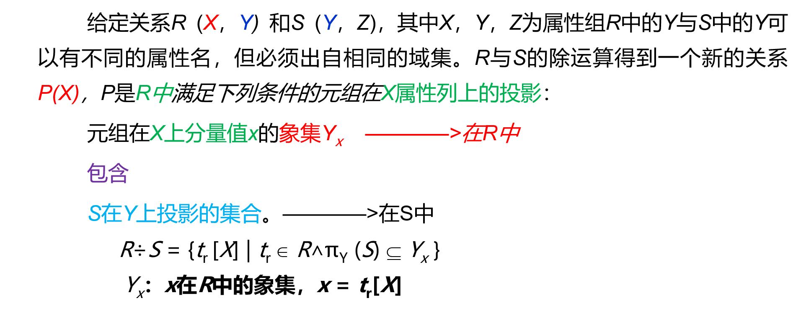

# 2.关系数据库

## 2.1关系数据库结构及形式化定义

### 2.1.1关系

1. 域：一组具有相同数据类型的值的集合（即取值范围）

2. 笛卡尔积：域上的一种集合运算。结果为一个集合，集合的每一个元素是一个元组，元组的每一个分量来自不同的域。

3. 基数：一个域允许的不同取值个数。

4. 笛卡尔积的基数：每个域不同取值的个数的乘积，或者说元组的个数

5. 关系：域的**笛卡尔积的子集**叫做在域上的**关系**，域的个数叫做关系的目或度。（即列数，属性的数目），注意广义上的笛卡尔积一般不能称为关系，因为存在无效的数据。

6. 关系：表

   列：属性

   行：元组

7. 候选码：某一属性组的值能唯一地标示一个元组，而其子集不能，则称该属性组为候选码

8. 主属性：候选码中的属性都称为主属性，注意：主属性非空。

9. 非主属性：候选码之外的属性称为非主属性

10. 全码：关系模式的所有属性是这个关系模式的候选码

11. 主码：从候选码中选取一组能唯一确定一个元组的属性组作为主码。

12. 三类关系：

    1）基本关系：实际存在的表，是实际存储数据的逻辑表示

    2）查询表：查询结果对应的表

    3）视图表：由基本表或其他视图表导出的表，是虚表，不对应实际存储的数据。

    注意：关系数据模型中的关系必须是有限集合。

    关系的每一个列必须附加一个属性名，属性名不能重名，这种方法取消了关系属性的有序性。

13. **基本关系的六条基本性质：（必考内容）**

    ① 列是同质的（Homogeneous）：每一列中的分量来自同一个域，是同一类型的数据

    ② 不同的列可出自同一个域

    * 其中的每一列称为一个属性

    * 不同的属性要给予不同的属性名

    ③ 列的顺序无所谓, 列的次序可以任意交换

    ④ 任意两个元组的候选码不能相同：相同就不是候选码了

    ⑤ 行的顺序无所谓，行的次序可以任意交换

    **⑥ 分量必须取原子值（不允许表中套表）**

### 2.1.2关系模式

1. 先来一张图：

   

2. 关系模式：对关系的描述，**是静态的、稳定的**

3. 关系：是关系模式在某一时刻的状态或内容，**是动态的、随时间不断变化的**，指后边的那个关系

4. 关系模式的形式化表示：

~~~html
//关系模式
R(U, D, DOM, F)
R       关系名
U       组成该关系的属性名集合
D       属性组U中属性所来自的域
DOM  	属性向域的映象集合
F       属性间的数据依赖关系集合

//可以简记为
R (U)    或    R (A1，A2，…，An)
R: 关系名
A1，A2，…，An  : 属性名
注：域名及属性向域的映象常常直接说明为属性的类型、长度
~~~

### 2.1.3关系数据库

1. 在一个给定的应用领域中，**所有关系的集合**构成一个关系数据库

2. **关系数据库的型与值**，不是关系的型与值

   1）关系数据库的型也称**关系数据库模式**，是对关系数据库的描述

   2）**关系数据库的值**是关系模式在**某一时刻对应的关系的集合**，简称为关系数据库

## 2.2关系操作

### 2.2.1基本的关系操作

1. 常用的基本操作：

   **查询：**选择、投影、连接、除、并、交、差

   **数据更新：**插入、删除、修改

2. **5种基本操作（必考）：**选择、投影、并、差、笛卡尔积          **注意：不算交**

3. 关系操作的特点：

   集合操作方式：操作的对象和结果都是集合，**一次一集合的方式**，操作对象是集合，操作结果亦为集合。

### 2.2.2关系数据语言的分类

## 2.3关系的完整性

### 2.3.1实体完整性（即主属性非空）

1. 若属性A是基本关系R的主属性，则属性A不能取空值

### 2.3.2参照完整性

1. 关系间的引用：关系与关系之间存在着联系

2. 外码：设F是基本关系R的一个或一组属性，但**不是关系R的主码**，**Ks是基本关系S的主码**。如果**F与Ks相对应**，则称F是基本关系R的**外码**，外码所在的基本关系叫做参照关系，Ks所在的关系叫做被参照关系。

   注：

   1）R、S不一定是不同的关系。

   2）目标关系S的主码Ks 和参照关系的外码F必须定义在**同一个（或一组）域上**

   3）外码并不一定要与相应的主码同名，当外码与相应的主码属于不同关系时，往往取相同的名字，以便于识别

   4）**外码的取值：**如果外码是参照关系的主属性，则不能为空（**实体完整性**），只能为被参照关系中主码的取值。如果外码**不是参照关系的主属性**，则可以**取空或者被参照关系主码的取值**

3. 两个不变性：指实体完整性和参照完整性

### 2.3.3用户定义完整性

1. 针对某一具体关系数据库的约束条件，反映某一具体应用所涉及的数据必须满足的语义要求

2. 关系模型应提供定义和检验这类完整性的机制，以便用统一的系统的方法处理它们，而不要由应用程序承担这一功能

## 2.4关系代数

### 2.4.1传统的集合运算

1. 传统的关系运算：

   并、交、差、笛卡尔积

   

   操作对象关系：

   操作方式：同数学中的并、交、差、笛卡尔积。只不过操作对象的元素是元组。另外需要注意能进行运算所需要满足的条件。

   对于并、交、差需要满足的关系：1）属性的数目相同；2）相应的属性取自同一个域

### 2.4.2专门的关系运算

常见的关系运算有选择、投影、连接、除

1. 选择：在关系R中选择满足给定条件的诸元组。

   表达式：$\sigma_F(R) = \{t | t \in R \and F(t) = ''true''\}$

   F：为选择条件，是一个逻辑表达式，基本形式为：$X_1 \theta  Y_1$，其中$\theta$为大于、小于、等于、不等于等。

   举例：

   

   **选择：$\sigma_{Sdept = "IS"}(Student)$**

   

2. 投影：从R中选择出若干属性列组成新的关系

   表达式：$\prod_{A} (R)= \{t[A] | t\in R\}$

   A为属性列，**即从R中选择A中属性列的元组，当然选择之后可能会删掉一些元组，因为避免重复。**

   举例：还是上方的关系，经过投影$\prod_{Sname, Sdept}(Student)$，结果如下：

   

3. 连接

   1）**一般连接：**从两个关系的笛卡尔积中选取属性间满足一定条件的元组

   （1）表达式：$R\bowtie_ {A \theta B} S = \{t_r^ \frown t_s | t_r \in R \and t_s \in S \and t_r[A] \theta t_s[B] \}$

   （2）A和B：分别为R和S上度数相等且可比的属性组

   （3）$\theta$表示比较运算符，

   （4）连接运算从R和S的广义笛卡尔积R×S中选取（R关系）在A属性组上的值与（S关系）在B属性组上值满足比较关系θ的元组 

   2）**等值连接：**当上述的运算符为等于号的时候

   （1）含义：从关系R与S的广义笛卡尔积中选取A、B属性值相等的那些元组，即等值连接为：

   （2）表达式：$R\bowtie_ {A = B} S = \{t_r^ \frown t_s | t_r \in R \and t_s \in S \and t_r[A] = t_s[B] \}$

   （3）仍然是从行的角度进行运算，而不涉及列

   （4）属性组可以不同

   3）**自然连接：**一种特殊的等值连接

   （1）与等值连接的不同：两个关系R和S必须具有相同的属性组

   （2）将结果中相同的属性列去掉

   （3）表达式：$R\bowtie S = \{t_r^ \frown t_s | t_r \in R \and t_s \in S \and t_r[A] = t_s[B] \}$

   4）由自然连接所引发的一系列问题：

   （1）悬浮元组：在做自然连接的时候被舍弃的元组

   （2）外连接：如果把舍弃的元组也保存在结果关系中，而在其他属性上填空值(Null)，这种连接就叫做**外连接**，外连接 = 左外连接 + 右外连接

   （3）左外连接：如果只把左边关系R中要舍弃的元组保留就叫做左外连接

   （4）右外连接：如果只把右边关系S中要舍弃的元组保留就叫做右外连接

4. 除

   1）除运算的意义：

   （1）假设关系R，S，RS，R关系拥有的属性是姓名，S关系拥有的属性是课程，RS关系拥有的属性是姓名和课程的联系，则RS/S表示**选出**所有**至少选了**表S中所列课程的学生的元组。

   （2）如下图：

   

   注：RS/S得到的关系：张三和李四构成的表，表示选修了全部课程的同学的集合。

   2）操作步骤：

   **定义：**

   

   **举例：**

   **R：**

   | A    | B    | C    |
   | ---- | ---- | ---- |
   | a1   | b1   | c2   |
   | a2   | b3   | c7   |
   | a3   | b4   | c6   |
   | a1   | b2   | c3   |
   | a4   | b6   | c6   |
   | a2   | b2   | c3   |
   | a1   | b2   | c1   |

   **S:**

   | B    | C    | D    |
   | ---- | ---- | ---- |
   | b1   | c2   | d1   |
   | b2   | c1   | d1   |
   | b2   | c3   | d2   |

   R÷S

   | A    |
   | ---- |
   | a1   |

   > (1) 找S与R的共同属性，即公式中的Y属性
   >
   > (2)计算R中每个X属性的象集，如果某个象集包含S在Y属性上的投影，则该属为R/S结果中的一个值。

   解答如下：

   在关系R中，A可以取四个值{a1,a2,a3,a4}，其中：

   a1的象集为：{（*b*1,*c*2），（*b*2,*c*3），（*b*2,*c*1）}

   a2的象集为：{（*b*3,*c*7），（*b*2,*c*3）}

   a3的象集为：{（*b*4,*c*6）}

   a4的象集为：{（*b*6,*c*6）}

   S在（B,C）上的投影为{(*b*1,*c*2),(*b*2,*c*3),(*b*2,*c*1)}。

   显然只有R的象集a1包含S在（B,C）属性组上的投影，所以R÷S={a1}。

